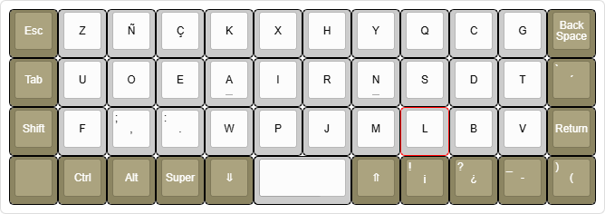
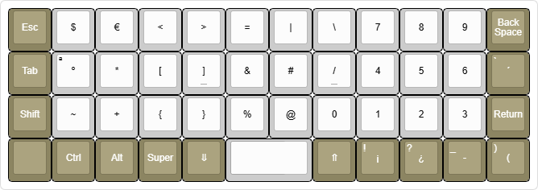
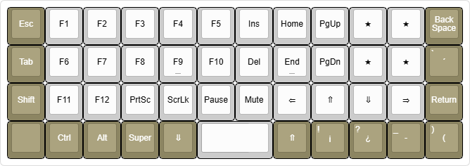

# JAKL (Just Another Keyboard Layout)

**JAKL** es una distribución de teclado ergonómica de formato 40%, diseñada mediante ingeniería específica para la **escritura de prosa en español** y la eficiencia en programación. Está diseñada para funcionar de forma nativa en teclados ortolineales (Planck, BM40) a través del firmware QMK.

## Filosofía y Objetivos de Diseño

JAKL ha sido desarrollado utilizando optimización algorítmica entrenada con la totalidad de "El ingenioso hidalgo Don Quijote de la Mancha". El diseño aborda las propiedades fonéticas y silábicas específicas del idioma español, diferenciándose de diseños anglocéntricos como QWERTY o Colemak.

### Métricas de Optimización
* **Alternancia de Manos:** Prioriza la estructura silábica "Consonante-Vocal" del español para maximizar la alternancia izquierda-derecha (equilibrio 50/50).
* **Distancia de Recorrido:** Minimiza el recorrido de los dedos colocando los n-gramas de mayor frecuencia en la fila central (*Home Row*).
* **Fuerza de los Dedos:** Distribuye la carga de trabajo priorizando los dedos índice y corazón, reduciendo drásticamente la tensión en los meñiques.
* **Simetría:** Utiliza la cuadrícula ortolineal para crear capas lógicas y simétricas para símbolos y navegación.

## Análisis del Layout

### Capa 1: Base
La capa base es el resultado de la optimización biomecánica para el español.

* **Mano Izquierda (Clúster de Vocales):** Las cinco vocales (`U O E A I`) están agrupadas en la mano izquierda. Esto asegura que prácticamente cada sílaba en español dispare una alternancia de mano.
* **Mano Derecha (Consonantes Frecuentes):** Las consonantes de mayor frecuencia (`R N S D T`) se sitúan en la *Home Row*.
* **Soporte Nativo:** Incluye teclas dedicadas para `Ñ` y `Ç` en la capa base, eliminando la necesidad de combinaciones incómodas.

### Capa 2: Símbolos y Lógica
Optimizada para código y entrada de datos, priorizando la alineación vertical sobre la dispersión horizontal.

* **Numpad Real:** Un bloque numérico dedicado de 3x3 (`7-8-9` en la fila superior) en la mano derecha. Esto permite una entrada de datos rápida utilizando la memoria muscular de calculadoras estándar.
* **Brackets Verticales:** Paréntesis `()`, corchetes `[]` y llaves `{}` están alineados en columnas verticales en la mano izquierda, simplificando la memorización espacial para programadores.

### Capa 0: Navegación y Flujo de Trabajo
Diseñada para mantener las manos en la posición base durante la edición de texto y el control del sistema.

* **Navegación Vim-Shifted:** Las flechas de dirección están mapeadas en la *Home Row* de la mano derecha (`R-N-S-D`), siguiendo una lógica espacial "tipo Vim" (Izquierda, Abajo, Arriba, Derecha) sin abandonar la posición de descanso.
* **Alineación Multimedia:** Los controles de volumen y reproducción están alineados verticalmente con el clúster de navegación para una operación intuitiva sin necesidad de mirar.
* **Sniper Mode:** Clic Izquierdo del ratón dedicado en la esquina inferior izquierda para un control de cursor de máxima precisión junto con las teclas de navegación.

/Trabajando para llevarlo a tierra/
